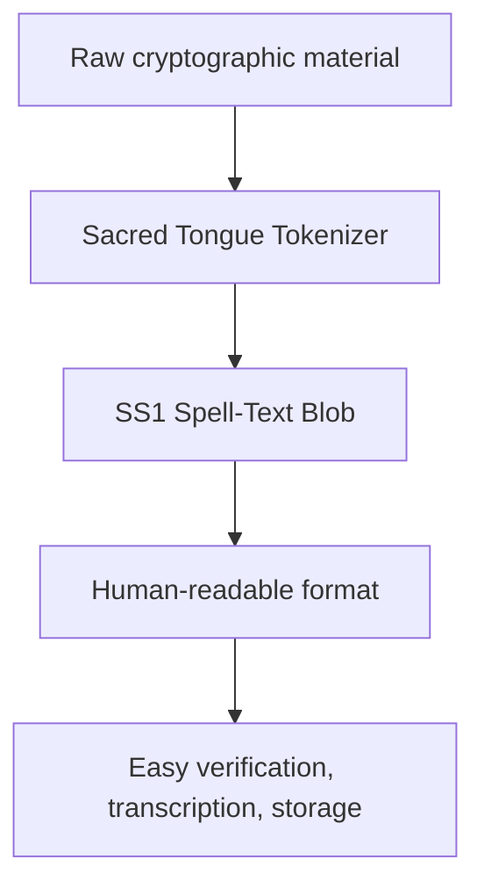

# Sacred Tongue Tokenizer - Complete Educational Guide

!!! info "Executive Summary"
    The Sacred Tongue Tokenizer (STT) is a deterministic byte-to-word encoding system that transforms cryptographic data (encryption keys, salts, nonces, authentication tags) into phonetically elegant, pronounceable spell-text tokens.

**Key Property:** Every byte (0-255) maps to exactly one unique token through a consistent formula:

```
byte b → prefix[b >> 4] + "'" + suffix[b & 0x0F]
```

---

## Part 1: Foundational Concepts

### 1.1 Why Deterministic Byte-to-Token Encoding?

Traditional approaches have limitations:

| Method | Limitation |
|--------|-----------|
| Hex encoding (0x2A) | Machine-readable but visually uninspiring |
| Base64 | Compact but character-limited on some platforms |
| Mnemonic systems (BIP-39) | Good for 12-word seeds, but not scaling to arbitrary byte sequences |

**The Sacred Tongue approach offers:**

- ✅ **Deterministic:** Same byte always produces same token
- ✅ **Phonetic:** Tokens are pronounceable (`vel'an`, `khor'eth`)
- ✅ **Consistent:** 256-word vocabulary per tongue (16 × 16 morpheme grid)
- ✅ **Reversible:** Full lossless encoding/decoding without lookup tables
- ✅ **Context-aware:** Different tongues for different cryptographic sections
- ✅ **Mnemonic-friendly:** Easier to remember/verify than hex/Base64

---

### 1.2 The Core Formula

For any byte `b` (0 ≤ b ≤ 255):

```
prefix_index = b >> 4          (high 4 bits, range 0-15)
suffix_index = b & 0x0F        (low 4 bits, range 0-15)

token = prefix[prefix_index] + "'" + suffix[suffix_index]
```

!!! example "Example Walkthrough"
    ```
    byte 0x2A (decimal 42)
      binary: 0010 1010
      
      >> 4 = 0010 = 2  → prefix
      & 0x0F = 1010 = 10 → suffix

    In Kor'aelin tongue:
      prefix[2] = "vel"
      suffix[10] = "an"
      
    Result: "vel'an"
    ```

---

### 1.3 The Six Sacred Tongues

Each tongue has distinct phonetic characteristics suited to its cryptographic role:

#### 🌊 Kor'aelin (ko) — Flow, Intent, Nonce

- **Use:** Nonce/initialization vector encoding
- **Character:** Flowing, melodic, liquid sounds (r, l, v)
- **Example tokens:** `sil'a`, `kor'ae`, `vel'an`, `thul'eth`
- **Phonetic style:** Vowel-rich with smooth consonant transitions
- **Metaphor:** The flowing stream that randomizes the cipher

#### ☀️ Avali (av) — Diplomacy, Context, Header/AAD

- **Use:** Additional Authenticated Data (AAD), metadata
- **Character:** Bright, open, clear vowel sounds
- **Example tokens:** `saina'a`, `talan'e`, `vessa'i`, `maren'o`
- **Phonetic style:** Lilting, almost song-like
- **Metaphor:** Clear communication of context without obscuring intent

#### ⚒️ Runethic (ru) — Binding, Salt

- **Use:** Salt values (cryptographic randomness source)
- **Character:** Hard, grounded, binding sounds (k, th, r)
- **Example tokens:** `khar'ak`, `drath'eth`, `bront'ul`, `vael'or`
- **Phonetic style:** Guttural, strong consonant clusters
- **Metaphor:** The solid anchor that binds randomness into the key

#### ⚙️ Cassisivadan (ca) — Bitcraft, Mathematics, Ciphertext

- **Use:** Encrypted payload (the actual ciphertext)
- **Character:** Playful, digital, consonant-heavy, dynamic
- **Example tokens:** `bip'a`, `bop'e`, `klik'i`, `loopa'ta`
- **Phonetic style:** Short bursts, staccato, high-energy
- **Metaphor:** The mechanical dance of bits becoming obscured meaning

#### 🏛️ Draumric (dr) — Structure, Tags

- **Use:** HMAC/authentication tags
- **Character:** Solid, authoritative, structural
- **Example tokens:** `anvil'a`, `tharn'e`, `mek'i`, `grond'o`
- **Phonetic style:** Heavy, firmly pronounced, ending-strong
- **Metaphor:** The structural integrity seal that guarantees authenticity

#### 🌑 Umbroth (um) — Veil, Redaction

- **Use:** Redaction wrappers, masked/hidden data
- **Character:** Breathy, soft, mysterious
- **Example tokens:** `veil'a`, `zhur'e`, `nar'i`, `shul'o`
- **Phonetic style:** Whispering quality, difficult to hear precisely
- **Metaphor:** The obscuring mist that protects what must not be seen

---

## Part 2: Mathematics & Properties

### 2.1 Determinism Proof

!!! success "Claim: Every byte produces exactly one unique token, and every token decodes to exactly one unique byte."

**Proof of Injectivity:**

1. Byte `b` determines unique `(prefix_idx, suffix_idx)` pair via bit operations
2. Each `(prefix_idx, suffix_idx)` pair maps to exactly one token via concatenation
3. Therefore: `b₁ = b₂ ⟺ token₁ = token₂`

**Practical implication:** No collision risk, no lookup table needed for decoding.

---

### 2.2 Vocabulary Size

```
16 prefixes × 16 suffixes = 256 unique tokens
```

This perfectly covers the range of 8-bit unsigned integers (0-255).

**One-to-one mapping with no waste or gaps.**

---

### 2.3 Entropy Analysis

**Information content per byte:**

- Raw byte: **8 bits** of information
- Encoded token: Still represents **8 bits**
- **No information loss**, just different representation

**Token length statistics:**

- Minimum: 5 characters (e.g., `sil'a`)
- Maximum: ~9 characters (e.g., `loopa'an`)
- Average: ~7 characters

**Storage efficiency:**

- Raw 32-byte key: **32 bytes**
- As spell-text: **~200-250 bytes** (including tongue markers)
- **Trade-off:** Readability/manageability vs. storage size

---

### 2.4 Namespace Properties

Each tongue maintains independent namespace, so same byte can have different phonetic representation:

```
Byte 0x2A:
  In Kor'aelin: vel'an
  In Avali: vessa'na
  In Runethic: bront'ar
  In Cassisivadan: loopa'sa
  In Draumric: forge'en
  In Umbroth: veil'or
```

!!! note "Domain-Specific Encoding"
    This makes it immediately clear which cryptographic component is being discussed without explicit labeling.

---

## Part 3: Cryptographic Applications

### 3.1 SS1 (Sacred Spell 1) Format

The SS1 Spell-Text Blob encapsulates all components of an authenticated encryption cipher:

```
SS1|kid=KEY_ID|aad=PLAINTEXT_AAD|salt=ru:TOKEN TOKEN...|nonce=ko:TOKEN TOKEN...|ct=ca:TOKEN TOKEN...|tag=dr:TOKEN TOKEN...
```

!!! example "Full SS1 Blob Example"
    ```
    SS1|kid=user-2026-001|aad=encrypt_backup_v2|salt=ru:bront'ak drath'eth|nonce=ko:sil'a kor'ae|ct=ca:bip'a bop'e klik'i loopa'ta|tag=dr:anvil'a tharn'e
    ```

---

### 3.2 Component Mapping

| Component | Tongue | Purpose | Typical Length |
|-----------|--------|---------|---------------|
| salt | Runethic (ru) | Pseudorandom source for KDF | 16-32 bytes |
| nonce | Kor'aelin (ko) | Initialization vector for cipher | 12 bytes (AES-GCM) |
| ciphertext | Cassisivadan (ca) | Encrypted payload | Variable |
| auth_tag | Draumric (dr) | HMAC/authentication proof | 16 bytes |
| aad | Plain text | Additional authenticated data | Variable |

---

### 3.3 Security Properties Preserved

!!! success "Claim: Encoding to spell-text preserves cryptographic security properties."

**Evidence:**

- ✅ **No key derivation:** Spell-text is pure representation change, not compression
- ✅ **No entropy reduction:** 8 bits maps to 8 bits, just different format
- ✅ **No timing side-channels introduced:** Byte lookup is O(1), deterministic
- ✅ **Reversible:** Decoding recovers exact original bytes

---

## Part 4: Implementation Guide

### 4.1 Basic Usage

```python
from sacred_tokenizer import SacredTongueTokenizer

# Encode a salt value
salt_bytes = b'\x42\x3c\x8f\xd1\x2a\x9e'
tokenizer = SacredTongueTokenizer('ru')  # Runethic
spell = tokenizer.encode(salt_bytes)

# Result: "bront'ak drath'eth bip'a bop'e..."
```

---

### 4.2 Section-Based Encoding

```python
from sacred_tokenizer import encode_to_spelltext

# Automatically selects correct tongue
nonce_spell = encode_to_spelltext(nonce_bytes, section='nonce')
# Returns tokens in Kor'aelin automatically

salt_spell = encode_to_spelltext(salt_bytes, section='salt')
# Returns tokens in Runethic automatically
```

---

### 4.3 Complete SS1 Blob Creation

```python
from sacred_tokenizer import format_ss1_blob

blob = format_ss1_blob(
    kid='user-backup-2026',
    aad='metadata',
    salt=salt_bytes,
    nonce=nonce_bytes,
    ciphertext=encrypted_data,
    tag=auth_tag
)

# Returns formatted string ready for storage
```

---

### 4.4 Parsing SS1 Blobs

```python
from sacred_tokenizer import parse_ss1_blob

components = parse_ss1_blob(blob_string)

# components = {
#     'version': 'SS1',
#     'kid': 'user-backup-2026',
#     'aad': 'metadata',
#     'salt': bytes(...),
#     'nonce': bytes(...),
#     'ct': bytes(...),
#     'tag': bytes(...)
# }
```

---

## Part 5: Cross-Domain Weighting System (LWS)

### 5.1 Langues Weighting Integration

The Langues Weighting System assigns importance scores to prefixes using the golden ratio (φ):

```
Weighting Formula:
w_i = φ^i / Σ(φ^j for j in 0..15)

Where φ = 1.618033988749895 (golden ratio)
```

**Interpretation:**

- Prefixes at lower indices (0-3) are weighted more heavily
- Creates natural hierarchical importance ranking
- φ exponential weighting matches perceptual importance in cryptography

!!! example "Weight Distribution"
    ```
    Prefix 0: weight ≈ 0.0015  (most important)
    Prefix 1: weight ≈ 0.0025
    Prefix 2: weight ≈ 0.0040
    Prefix 3: weight ≈ 0.0065
    ...
    Prefix 15: weight ≈ 0.2340  (least weighted)
    ```

---

### 5.2 Tongue Signatures

Each tongue has a unique SHA-256 hash signature computed from its vocabulary:

```python
def get_tongue_signature(tongue_code: str) -> bytes:
    tongue = TONGUES[tongue_code]
    vocab_str = '|'.join(tongue.prefixes) + '||' + '|'.join(tongue.suffixes)
    return hashlib.sha256(vocab_str.encode('utf-8')).digest()
```

**Uses:**

- **Authentication:** Verify tongue version/integrity
- **Polyglot interoperability:** Different systems confirm using same vocabulary
- **KDF domain separation:** Include tongue signature in key derivation

---

## Part 6: Comparative Analysis

### 6.1 Sacred Tongue vs. Alternatives

| Feature | Hex | Base64 | BIP-39 | Mnemonic | Sacred Tongue |
|---------|-----|--------|--------|----------|---------------|
| Readability | ✗ Machine-only | ~ Moderate | ✓ Words | ✓ Words | ✓✓ Phonetic words |
| Reversibility | ✓ Simple | ✓ Simple | ✓ Word list | ✓ Word list | ✓ Deterministic formula |
| Domain awareness | ✗ Generic | ✗ Generic | ✗ Generic | ✗ Generic | ✓ Six specialized tongues |
| Scalability | ✓ Unlimited | ✓ Unlimited | ✗ Only ~12 words | ✗ ~12 words | ✓ Unlimited |
| Memorability | ✗ Very poor | ✗ Poor | ✓ Good | ✓ Excellent | ✓ Good (phonetic) |
| Storage overhead | 1× | 1.33× | 10× | 10× | 1.5× |
| Implementation complexity | Trivial | Simple | Simple | Simple | Moderate |

---

### 6.2 Why Phonetic Elegance Matters

**Human factors in cryptography:**

- **Verification:** Users verify checksums better with phonetically structured strings
- **Transcription:** Spell-text is more reliably transcribed (voice, handwriting)
- **Memory:** Linguistic tokens have better recall than random character sequences
- **Cultural resonance:** Stylized language creates psychological investment

!!! example "Example Scenario"
    ```
    Hex checksum:    "2a3c8fd12a9edbc4f..."  (tedious to verify)
    Base64 checksum: "Kjw90SqevcTf+yJ2R..." (still abstract)
    Spell-text:      "bront'ak drath'eth bip'a bop'e..." (strangely memorable)
    ```

---

## Part 7: Integration Patterns

### 7.1 Cryptographic Workflow



---

### 7.2 KDF Integration

```python
# Include tongue signature for domain separation
kdf_input = password + salt + get_tongue_signature('ko') + context

# This ensures each tongue's KDF produces independent key material
```

---

### 7.3 Polyglot Interoperability

Different systems can use same SS1 blob format:

```
System A (TypeScript):
  Encodes using Sacred Tongue library
      ↓ shared SS1 blob string ↓
System B (Python):
  Decodes using Sacred Tongue library

Both systems must have identical wordlists → verified via tongue signatures
```

---

## Part 8: Educational Exercises

### Exercise 1: Manual Encoding

**Problem:** Encode byte 0x7F using Kor'aelin

??? success "Solution"
    ```
    0x7F = 127 decimal = 0111 1111 binary

    prefix_idx = 0111 = 7  → kor'aelin.prefixes[7] = "ael"
    suffix_idx = 1111 = 15 → kor'aelin.suffixes[15] = "esh"

    Result: "ael'esh"
    ```

---

### Exercise 2: Reverse Decoding

**Problem:** Decode "drath'eth" from Runethic

??? success "Solution"
    ```
    Lookup positions in Runethic:
      prefix "drath" → index 1
      suffix "eth" → index 1

    Reconstruct byte:
      (1 << 4) | 1 = 0001 0001 = 0x11 = 17 decimal

    Result: byte 17 or 0x11
    ```

---

### Exercise 3: Complete SS1 Flow

**Task:** Create and parse an SS1 blob for a 16-byte encryption key

```python
import os
from sacred_tokenizer import format_ss1_blob, parse_ss1_blob

# Generate random crypto material
salt = os.urandom(16)
nonce = os.urandom(12)
key = os.urandom(32)
tag = os.urandom(16)

# Format as SS1 blob
blob = format_ss1_blob(
    kid='exercise-key-1',
    aad='test_context',
    salt=salt,
    nonce=nonce,
    ciphertext=key,
    tag=tag
)

# Parse it back
parsed = parse_ss1_blob(blob)

# Verify round-trip
assert parsed['salt'] == salt
assert parsed['nonce'] == nonce
assert parsed['ct'] == key
assert parsed['tag'] == tag

print("✓ Round-trip successful!")
```

---

## Part 9: Common Pitfalls & Solutions

### Pitfall 1: Token Parsing Errors

**Problem:** Mixing tongue prefixes across tongues

```python
# ✗ WRONG - mixing Kor'aelin and Runethic tokens
spelltext = "ko:sil'a ru:drath'eth"  # Inconsistent format

# ✓ CORRECT - use section-based encoding
ko_spell = encode_to_spelltext(nonce_bytes, 'nonce')
ru_spell = encode_to_spelltext(salt_bytes, 'salt')
```

---

### Pitfall 2: Bit Operation Errors

**Problem:** Incorrect nibble extraction

```python
# ✗ WRONG
prefix_idx = b >> 8  # Shifts out of 8-bit range!
suffix_idx = b & 0xF0  # Wrong mask

# ✓ CORRECT
prefix_idx = b >> 4       # High 4 bits
suffix_idx = b & 0x0F     # Low 4 bits
```

---

### Pitfall 3: Vocabulary Version Mismatches

**Problem:** Different systems using different wordlists

```python
# ✓ SOLUTION - Always verify tongue signatures match
system_a_sig = get_tongue_signature('ko')
system_b_sig = get_tongue_signature('ko')

if system_a_sig != system_b_sig:
    raise VersionMismatchError("Tongue vocabulary mismatch!")
```

---

### Pitfall 4: Character Encoding Issues

**Problem:** Unicode normalization with apostrophes

```python
# ✗ WRONG - different apostrophe characters
token1 = "sil'a"   # U+0027 APOSTROPHE
token2 = "sil'a"   # U+2019 RIGHT SINGLE QUOTATION MARK

# ✓ SOLUTION - Normalize to ASCII apostrophe in spec
assert ord(token1[3]) == 0x27  # ASCII apostrophe only
```

---

## Part 10: Advanced Topics

### 10.1 Cross-Tongue Cryptographic Protocols

**Concept:** Use multiple tongues in a single protocol to create cryptographic domain separation:

```
Protocol Domain: "backup_encryption_2026"

KDF_salt = SHA256(domain + ko_sig + ca_sig + dr_sig)
KDF_key = PBKDF2(password, KDF_salt, iterations)

Different protocol = different tongue signature combo = different KDF output
```

---

### 10.2 Tongue-Based Authentication

**Idea:** Tongue choice itself carries meaning in multi-party protocols:

```
Message format:
  [KO-TOKENS]: nonce/randomness element
  [RU-TOKENS]: binding/commitment element
  [CA-TOKENS]: payload element
  [DR-TOKENS]: signature/proof element

Protocol participants verify not just content but also tongue sequence.
```

---

### 10.3 Phonetic Cryptanalysis Resistance

!!! warning "Observation"
    While spell-text appears "readable," the phonetic encoding doesn't aid cryptanalysis:

**Attacker sees:** `bront'ak drath'eth bip'a bop'e...`

**But:**

- ✓ No statistical patterns between linguistic sound and cryptographic content
- ✓ Each byte equally represented in token vocabulary
- ✓ No frequency analysis shortcut (unlike natural language)
- ✓ Deterministic encoding preserves original entropy

**Result:** Phonetic readability ≠ linguistic vulnerability

---

## Part 11: Appendix - Complete Wordlist Reference

### Kor'aelin (ko) - Nonce/Intent

```
Prefixes: sil, kor, vel, zar, keth, thul, nav, ael, ra, med, gal, lan, joy, good, nex, vara
Suffixes: a, ae, ei, ia, oa, uu, eth, ar, or, il, an, en, un, ir, oth, esh
```

### Avali (av) - Header/AAD

```
Prefixes: saina, talan, vessa, maren, oriel, serin, nurel, lirea, kiva, lumen, calma, ponte, verin, nava, sela, tide
Suffixes: a, e, i, o, u, y, la, re, na, sa, to, mi, ve, ri, en, ul
```

### Runethic (ru) - Salt/Binding

```
Prefixes: khar, drath, bront, vael, ur, mem, krak, tharn, groth, basalt, rune, sear, oath, gnarl, rift, iron
Suffixes: ak, eth, ik, ul, or, ar, um, on, ir, esh, nul, vek, dra, kh, va, th
```

### Cassisivadan (ca) - Ciphertext/Bitcraft

```
Prefixes: bip, bop, klik, loopa, ifta, thena, elsa, spira, rythm, quirk, fizz, gear, pop, zip, mix, chass
Suffixes: a, e, i, o, u, y, ta, na, sa, ra, lo, mi, ki, zi, qwa, sh
```

### Umbroth (um) - Redaction/Veil

```
Prefixes: veil, zhur, nar, shul, math, hollow, hush, thorn, dusk, echo, ink, wisp, bind, ache, null, shade
Suffixes: a, e, i, o, u, ae, sh, th, ak, ul, or, ir, en, on, vek, nul
```

### Draumric (dr) - Tags/Structure

```
Prefixes: anvil, tharn, mek, grond, draum, ektal, temper, forge, stone, steam, oath, seal, frame, pillar, rivet, ember
Suffixes: a, e, i, o, u, ae, rak, mek, tharn, grond, vek, ul, or, ar, en, on
```

---

## Part 12: Research Extensions

### Future Directions

1. **Linguistic Analysis:** Measure memorability of each tongue across different language backgrounds
2. **Cryptanalysis:** Formal proof that phonetic encoding introduces no new weaknesses
3. **Polyglot Extensions:** Design additional tongues for specialized domains
4. **Neural Integration:** Train neural networks to recognize valid tokens (anomaly detection)
5. **Cross-Cultural Phonetics:** Adapt tongues for pronunciation across different language families

---

!!! info "Document Metadata"
    - **Version:** 1.0
    - **Last Updated:** January 2026
    - **Author:** Research & Education Division
    - **Classification:** Educational Reference
